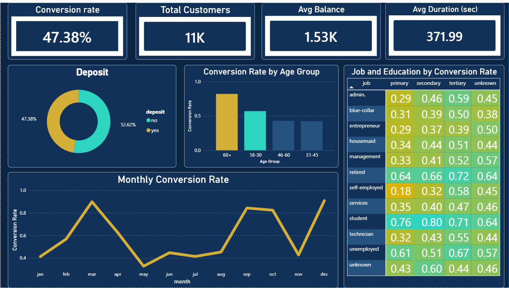
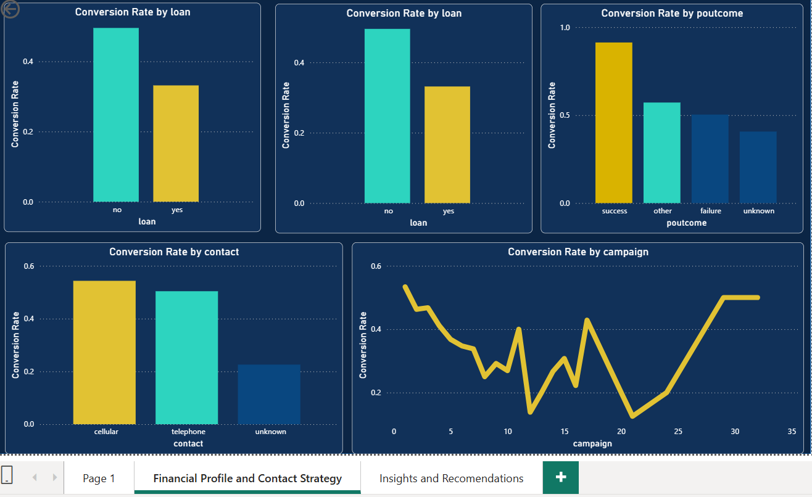

# Bank Marketing Campaign Analysis

## Project Overview

This project analyses a bank's direct marketing campaign to identify the customer characteristics and campaign strategies associated with successful term deposit subscriptions.

Using SQL for exploratory and business analysis and Power BI for interactive visualisation, the project examines customer demographics, financial profiles, previous campaign outcomes, and contact strategies to uncover actionable insights that can improve future marketing performance.

> **Project Context:** This project was completed as an end-to-end analytics case study, covering data exploration, business analysis, dashboard development, and stakeholder reporting.

**Dataset Size:** 11,162 customer records × 17 variables

**Tools Used:**
- MySQL Workbench
- Power BI
- Microsoft Word
- Microsoft PowerPoint

---

# Dashboard Preview





---

# Business Problem

Banks invest significant resources in telemarketing campaigns to promote financial products such as term deposits. However, contacting every customer equally is both costly and inefficient.

The objective of this project was to identify the customer segments most likely to subscribe, evaluate the effectiveness of previous marketing efforts, and provide recommendations that could improve campaign targeting and conversion rates.

---

# Repository Structure

```text
bank-marketing-analysis/
│
├── sql/
│   └── Bank_marketing_analysis.sql
│
├── dashboard/
│   └── bank_marketing_dashboard.pbix
│
├── report/
│   └── Bank_Marketing_Case_Study_Report.docx
│
├── presentation/
│   └── Bank_Marketing_Case_Study_Presentation.pptx
│
├── screenshots/
│   ├── Overview_Dashboard_page.png
│   └── Important_charts.png
│
└── README.md
```

---

# Analysis Workflow

The project followed a structured analytics workflow:

1. Explored and assessed the raw dataset using MySQL.
2. Evaluated data quality and reviewed missing or unknown values.
3. Performed business analysis across customer demographics, financial characteristics, and campaign history.
4. Calculated conversion rates for key customer segments.
5. Built an interactive Power BI dashboard to communicate findings.
6. Produced a written case study and presentation summarising business recommendations.

---

# Data Exploration

Before analysis, the dataset was assessed to understand its structure and overall quality.

Key exploration activities included:

- Confirmed **11,162 customer records** across **17 variables**
- Reviewed missing and `"unknown"` values across categorical fields
- Verified completeness of key numerical variables including Age, Balance, Duration, Campaign, Pdays and Previous
- Generated descriptive statistics to understand customer and campaign distributions

---

# Business Questions

The analysis explored the following questions:

- Which customer groups have the highest subscription rates?
- Does previous campaign success influence future conversion?
- How do occupation and education affect subscription behaviour?
- Do existing housing or personal loans influence conversion?
- Which contact method performs best?
- Does the number of contact attempts affect campaign success?
- Are there seasonal patterns in customer subscriptions?

---

# Key Findings

### Previous campaign success is the strongest predictor of conversion

Customers who subscribed during a previous campaign converted at **91.32%**, almost double the overall conversion rate of **47.4%**. Despite this, they represented only **9.6%** of all customers contacted, suggesting an opportunity for more targeted follow-up campaigns.

### Profession strongly influences conversion

Students (**74.72%**) and retirees (**66.32%**) recorded the highest subscription rates, while blue-collar workers (**36.42%**) and entrepreneurs (**37.5%**) converted significantly below average.

### Existing debt reduces subscription likelihood

Customers with housing or personal loans consistently converted at lower rates than customers without existing debt.

### Contact strategy affects campaign performance

Cellular communication achieved the strongest conversion results, while subscription rates declined noticeably after more than two or three contact attempts.

### Subscription behaviour follows seasonal patterns

Conversion rates were highest in **December** and lowest in **May**, indicating that campaign timing may influence customer response.

---

# Recommendations

Based on the analysis, the following actions could improve campaign effectiveness:

1. Prioritise customers with previously successful campaign outcomes for future marketing campaigns.
2. Investigate why blue-collar and entrepreneur segments convert below average before maintaining current targeting levels.
3. Limit customer contact attempts to two or three interactions before reallocating effort towards new prospects.
4. Continue prioritising cellular communication as the primary customer contact channel.
5. Schedule larger campaign activities around historically higher-converting months such as December and March.

---

# Business Value

This project demonstrates how customer segmentation and campaign analytics can support more effective marketing decisions. By identifying high-converting customer groups, evaluating campaign effectiveness, and analysing behavioural patterns, the findings provide practical recommendations for improving conversion rates while reducing unnecessary marketing effort.

---

# Skills Demonstrated

- SQL (MySQL)
- Exploratory Data Analysis (EDA)
- Customer Segmentation
- Conversion Rate Analysis
- Business Analysis
- Data Quality Assessment
- Power BI Dashboard Development
- Data Visualisation
- Business Storytelling
- Technical Reporting
- Stakeholder Presentation

---

# Deliverables

The repository includes:

- SQL analysis scripts
- Interactive Power BI dashboard
- Written business case study
- Executive presentation summarising findings and recommendations

---

# Author

**Patricia Fagbola**

Aspiring Data Analyst with experience in SQL, Excel, Power BI, and Python.

- Email: fagbola.pt@gmail.com
- LinkedIn: https://www.linkedin.com/in/patricia-fagbola-656566387
