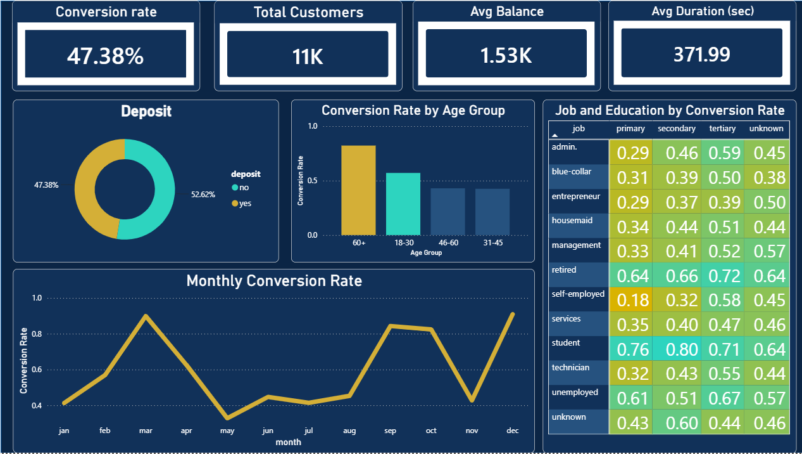
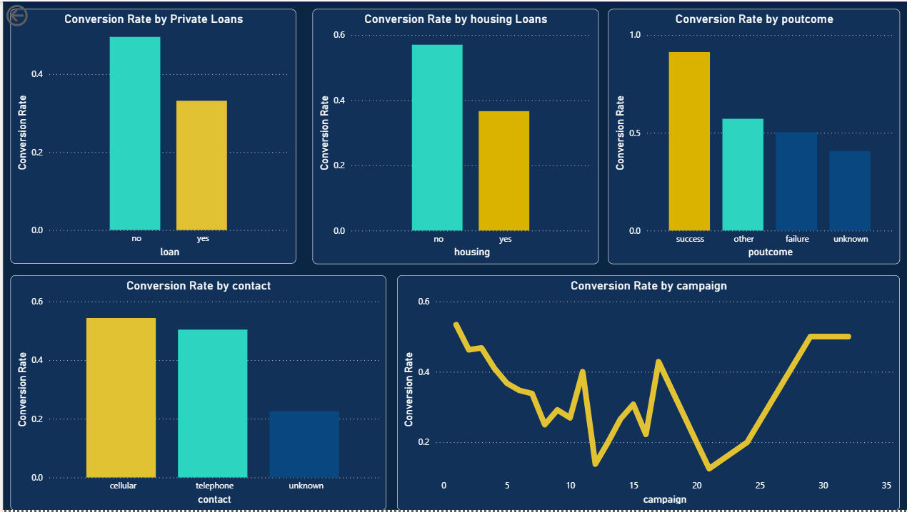

# Bank Marketing Campaign Analysis

**Author:** Patricia Fagbola
**Tools:** MySQL Workbench, Power BI, Microsoft Word, Microsoft PowerPoint

---

## Summary

I analysed a bank's direct marketing campaign of 11,162 customers to find out which customer segments are most likely to subscribe to a term deposit, so future campaigns can target more efficiently instead of contacting everyone equally. Overall, 47.38% of customers contacted subscribed. The strongest signal was previous campaign success: customers who had subscribed before converted at 91.32%, almost double the overall rate, but they made up only 9.6% of everyone contacted. Students and retirees converted far above average, cellular contact outperformed telephone, and conversion was highest in December and lowest in May.

---

## Introduction

Banks invest heavily in telemarketing campaigns to promote financial products such as term deposits, but contacting every customer equally is costly and inefficient.

This project looks at a past campaign's results to understand which customers actually convert, so future campaigns can be targeted rather than blanket.

---

## Business Problem

The bank needed to know which customer segments are most likely to subscribe to a term deposit, whether previous campaign outcomes predict future conversion, and which contact strategies perform best, so that marketing effort and cost could be focused on higher-probability customers instead of contacting the full customer base.

---

## Dataset Overview

- **Records:** 11,162 customers
- **Attributes:** 17 columns covering demographics, financial profile, and campaign history
- **Source:** [add where you got the dataset]
- **Target variable:** deposit (yes/no)

**Data quality:**
- No missing values in age, balance, or duration
- "Unknown" values found in: job (70), education (497), contact (2,346), poutcome (8,326)
- Target split: 5,289 subscribed (47.38%), 5,873 did not (52.62%)

---

## Method of Analysis

The analysis was done in MySQL Workbench, using SQL for exploration and business analysis, then visualised in Power BI.

The workflow:
- Checked row count, column structure, and data types
- Assessed missing and "unknown" values across categorical fields
- Pulled summary statistics (min, max, average) for the numeric fields: age, balance, duration, campaign, pdays, previous
- Grouped customers by age, job, education, housing loan, personal loan, previous outcome, contact method, and month to calculate conversion rate per segment
- Built an interactive Power BI dashboard from the results

Conversion rate is calculated as customers who subscribed divided by total customers in that group, for example:

```sql
SELECT job,
  COUNT(*) AS total,
  SUM(CASE WHEN deposit = 'yes' THEN 1 ELSE 0 END) AS converted,
  ROUND(SUM(CASE WHEN deposit = 'yes' THEN 1 ELSE 0 END) * 100.0 / COUNT(*), 2) AS conversion_rate
FROM bank
GROUP BY job
ORDER BY conversion_rate DESC;
```

---

## Dashboard

The dashboard has three pages: an overview page, a financial profile and contact strategy page, and an insights and recommendations page.





To explore the full dashboard, open `dashboard/bank_marketing_dashboard.pbix` in Power BI.

---

## Insights

**1. Past subscribers are a warm lead.** Customers who subscribed during a previous campaign converted at 91.32%, compared to 50.33% for a previous failure and an overall average of 47.38%. Despite converting at nearly double the average, they represented only 9.6% of all customers contacted, suggesting the bank is under-using its highest-converting audience.

**2. Profession matters.** Conversion varies widely by profession, from 74.72% for students and 66.32% for retirees down to 36.42% for blue-collar workers and 37.5% for entrepreneurs, roughly a 2x gap. Blue-collar workers and technicians, the two largest job segments at 33% of all contacts combined, both converted below the 47.38% overall average.

**3. It's life stage, not just age.** Customers aged 60 and above and those aged 18 to 30 convert at a noticeably higher rate than customers aged 31 to 60, likely because middle-aged customers are juggling more financial commitments.

**4. Education correlates with conversion.** Customers with tertiary education consistently convert at a higher rate than those with primary education, across most job categories. This may reflect financial literacy or familiarity with savings products.

**5. Existing debt lowers conversion.** Customers without a housing or personal loan convert at roughly double the rate of customers who hold one.

**6. Channel and frequency matter.** Cellular contact outperforms telephone, and conversion drops sharply after a few contact attempts.

**7. Conversion peaks in December and March.** This is likely tied to year-end bonus and savings behaviour, though lower contact volume in these months may also be inflating the rate.

**Limitations:** This is historical campaign data. It shows which segments converted more, not why, and factors like loan status, education, or contact method may be correlated with conversion without directly causing it. The seasonal pattern in particular should be checked against contact volume before acting on it, since fewer contacts in a given month can inflate its conversion rate.

---

## Recommendations

1. **Re-engage past subscribers.** This is the highest-converting segment, so prioritise renewed outreach to them.
2. **Investigate the profession gap.** Students and retirees convert far more than blue-collar workers and entrepreneurs, but the reason is unclear and needs further research before targeting on profession alone.
3. **Re-think messaging for middle-aged customers,** the lowest-converting age group. Test offers suited to their financial stage rather than using the same pitch across all ages.
4. **Simplify the pitch.** Spend more time explaining term deposit benefits, especially to less financially literate customers.
5. **Explore the loan and debt link** before designing offers for customers who already hold loans, since they convert less.
6. **Prioritise cellular contact** as the primary channel, keeping telephone as backup only.
7. **Cap contact attempts at two to three calls.** Conversion drops sharply after that, so redirect effort to new leads instead.
8. **Time major campaign pushes around December and March,** the higher-converting months, but confirm the pattern holds even after accounting for contact volume before committing staffing and budget to it.

---

## Repository Structure

```text
bank-marketing-analysis/
├── README.md
├── sql/
│   └── Bank_marketing_analysis.sql
├── dashboard/
│   └── bank_marketing_dashboard.pbix
├── report/
│   └── Bank_Marketing_Case_Study_Report.docx
├── presentation/
│   └── Bank_Marketing_Case_Study_Presentation.pptx
├── Overview_Dashboard_page.png
└── Important_charts.png
```
